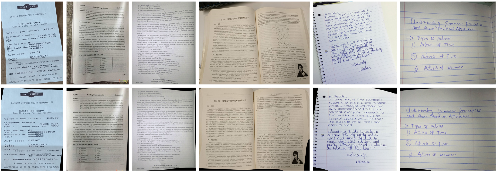

:boom: **Good news! Our new work exhibits state-of-the-art performances on the [DocUNet Benchmark](https://www3.cs.stonybrook.edu/~cvl/docunet.html) dataset:
[DocScanner: Robust Document Image Rectification with Progressive Learning](https://drive.google.com/file/d/1mmCUj90rHyuO1SmpLt361youh-07Y0sD/view?usp=share_link)** with [Repo](https://github.com/fh2019ustc/DocScanner).

:boom: **Good news! A comprehensive list of [Awesome Document Image Rectification](https://github.com/fh2019ustc/Awesome-Document-Image-Rectification) methods is available.** 

# DocTr++

> [DocTr++: Deep Unrestricted Document Image Rectification](https://drive.google.com/file/d/1EZM1T733Ouyu-8xwF-U3aYubavB1zuQa/view?usp=share_link)

> DocTr++ is an enhanced version of the original [DocTr: Document Image Transformer for Geometric Unwarping and Illumination Correction](https://github.com/fh2019ustc/DocTr), aiming to rectify various distorted document images in the wild without any boundary restrictions.

Any questions or discussions are welcomed!


## Training

- For geometric unwarping, we train the network using the [Doc3D](https://github.com/fh2019ustc/doc3D-dataset) dataset.


## Demo 
1. Put the pretrained model to `$ROOT/model_pretrained/`.
2. Put the distorted images in `$ROOT/distorted/`.
3. Run the script and the rectified images are saved in `$ROOT/rectified/` by default.
    ```
    python inference.py
    ```

## Evaluation
- ***Image Metrics:***  We propose the metrics MS-SSIM-M and LD-M, different from that for [DocUNet Benchmark](https://www3.cs.stonybrook.edu/~cvl/docunet.html) dataset. We use Matlab 2019a. Please compare the scores according to your Matlab version. We provide our Matlab interface file at ```$ROOT/ssim_ld_eval.m```.
- ***OCR Metrics:*** The index of 70 document (70 images) in [UDIR test set](https://drive.google.com/drive/folders/15rknyt7XE2k6jrxaTc_n5dzXIdCukJLh?usp=share_link) used for our OCR evaluation is provided in ```$ROOT/ocr_eval.py```. 
The version of pytesseract is 0.3.8, and the version of [Tesseract](https://digi.bib.uni-mannheim.de/tesseract/) in Windows is recent 5.0.1.20220118. 
Note that in different operating systems, the calculated performance has slight differences.

## Citation

If you find this code useful for your research, please use the following BibTeX entry.

```
@inproceedings{feng2021doctr,
  title={DocTr: Document Image Transformer for Geometric Unwarping and Illumination Correction},
  author={Feng, Hao and Wang, Yuechen and Zhou, Wengang and Deng, Jiajun and Li, Houqiang},
  booktitle={Proceedings of the 29th ACM International Conference on Multimedia},
  pages={273--281},
  year={2021}
}
```

```
@article{feng2021docscanner,
  title={Deep Unrestricted Document Image Rectification},
  author={Feng, Hao and Liu, Shaokai and Deng, Jiajun and Zhou, Wengang and Wu, Feng and Li, Houqiang},
  journal={arXiv},
  year={2023}
}
```

